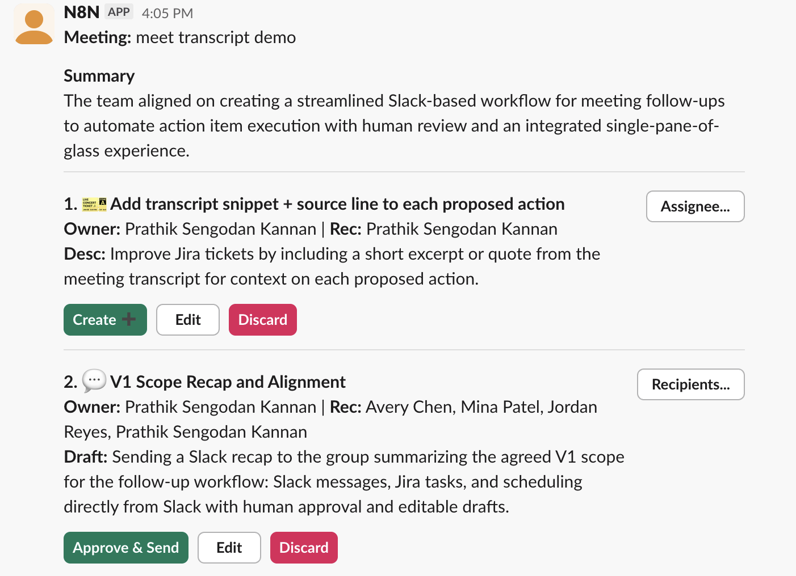
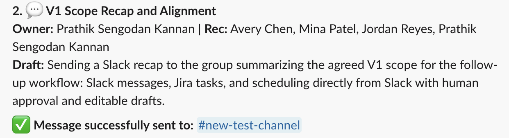
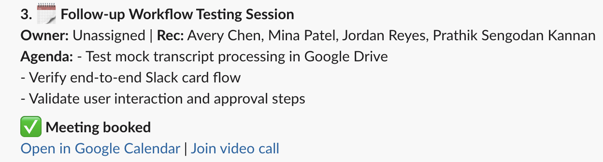

# Meeting-Followup-Agent  
### Closing the “Post-Meeting Action Gap”

An AI-powered meeting follow-up workflow built in n8n that triggers when meeting notes are created in Google Drive, reasons over the raw transcript, and turns meeting outcomes into execution-ready Slack messages, Jira tasks, and Google Calendar events — all proposed, reviewed, edited, and approved directly inside Slack without leaving the workspace.

## 📌 Problem Statement

High-stakes meetings still suffer from **Action Item Fragmentation**.

Modern tools (Google Meet Notes) have significantly improved **capture**:
- They generate transcripts  
- They extract summaries  
- They surface action items with owners  

However, the real problem begins ***after*** the meeting.

### The Pain Point
Product Managers, Engineering Managers, Tech Leads, and other senior stakeholders attend **dozens of meetings per week**. Follow-ups are scattered across individual meeting notes, forcing leaders to:

- Revisit multiple meeting-note documents across days or weeks  
- Mentally reconstruct what is still pending vs. already completed  
- Manually create Jira tickets, send Slack updates, or schedule follow-ups  
- Track execution without a single, unified view  

There is **no single pane of glass** that converts meeting outcomes into **ready-to-execute actions** inside the tools where work actually happens.

The administrative cost isn’t interpretation — it’s **coordination and execution at scale**.

---

## The Solution  
### A Human-in-the-Loop, AI-Powered Meeting Follow-Up Workflow

This project is an **event-driven workflow built in n8n** that activates automatically **when meeting notes are created in Google Drive at the end of a meeting**.

Instead of asking leaders to revisit every meeting-notes document, the workflow:
- Reads the **raw meeting transcript**
- Proposes concrete, execution-ready follow-up actions
- Centralizes all proposed actions into a **single approval surface**
- Executes only what a human explicitly approves

Follow-ups are delivered directly into **Slack as interactive cards**, turning post-meeting work into a lightweight review-and-approve flow.

This acts as a **lightweight Chief of Staff for post-meeting execution** — reducing cognitive load while preserving human judgment.

---

## Why This Approach?

### Why AI?
Meetings are inherently unstructured:
- Action items are often implied rather than explicitly stated  
- Ownership may be distributed across participants  
- Priority and urgency are contextual  

AI is used here to:
- Reason over **raw conversational transcripts**
- Identify implicit and explicit follow-ups
- Normalize outcomes into **structured, executable proposals**

This is not summarization.  
This is **decision support for execution**.

---

### Why not rely solely on Google Meet “Action Items”?
#### Strategic Rationale: Custom LLM vs. Native Summarization

Google Meet action items are useful — but insufficient for execution at scale.

**Key limitations of native summaries:**
- Optimized for human readability, not automation  
- Black-box outputs with no schema guarantees  
- Limited to explicitly stated tasks  

**Why a custom LLM approach works better:**

| Dimension     | Native Google AI       | Custom Agent       | Why It Matters                            |
|---------------|------------------------|--------------------|-------------------------------------------|
| Output Format | Narrative text         | Strict JSON schema | Enables safe, deterministic API execution |
| Inference     | Explicit tasks only    | Intent recognition | Captures implicit follow-ups              |
| Delivery      | Pull-based (docs)      | Push-based (Slack) | Meets users where work happens            |

This workflow treats meeting notes as **input**, not the final artifact — and focuses on **execution orchestration**, not documentation.

---

### Why Slack?
Slack is where execution already happens.

From a product standpoint:
- Slack is the **system of record for coordination**
- It’s where PMs, EMs, and ICs notice work
- It minimizes context switching compared to dashboards or email

By delivering follow-ups as **interactive Slack cards**, this workflow:
- Meets users where they already work  
- Reduces friction to review and act  
- Turns follow-up into an inline decision  

Slack becomes the **approval and execution layer**, not just a notification channel.

---

### Why Human-in-the-Loop (HITL)?
In leadership contexts, automated execution carries real risk.

Incorrect messages, tickets, or meetings can:
- Create confusion  
- Damage trust  
- Introduce downstream cleanup work  

This workflow deliberately enforces a **Draft → Review → Approve** model:
- AI accelerates sense-making and proposal  
- Humans retain final authority  
- Irrelevant or low-confidence actions are safely discarded  

The AI remains an assistant — not an autonomous actor.

---

## 📸 Example: End-to-End Slack Experience

Below is an example of the complete **post-meeting follow-up workflow executed entirely from Slack**.

Once meeting notes are created, the system proposes follow-ups, pauses for human review, and executes approved actions — **without requiring users to leave Slack**.

---

### 1️⃣ AI-Proposed Follow-Ups (Approval Required)

After meeting notes are created in Google Drive, the workflow analyzes the raw transcript and posts **AI-proposed follow-up actions** as an interactive Slack card.

Each action includes:
- Suggested owner and recipients
- Context pulled directly from the meeting
- Clear **Approve / Edit / Discard** controls

This ensures AI accelerates execution **without bypassing human judgment**.

---

### 2️⃣ Jira Task Creation (Approved Action)

When a task-related follow-up is approved, the workflow creates a **Jira issue** and immediately updates the Slack card with confirmation.

Key behavior:
- No Jira UI interaction required
- Issue key and status are surfaced directly in Slack
- The action is marked as completed to avoid duplicate work

---

### 3️⃣ Slack Message Execution

Slack-based follow-ups (e.g., recaps, stakeholder updates) can be **edited and sent inline**.

Once approved:
- The message is delivered to the selected channel or user
- The Slack card updates to confirm successful delivery
- No copy-paste or context switching is required

---

### 4️⃣ Calendar Scheduling (Meeting Booked)

Scheduling-related actions allow users to find times, confirm attendees, and book meetings — all from Slack.

Once confirmed:
- A Google Calendar event is created
- Meeting links and calendar access are surfaced inline
- The original action is marked as completed

---

### 🔑 Why This Matters

These examples demonstrate the core product philosophy of this workflow:

- **Slack as the single pane of glass** for post-meeting execution  
- **Human-in-the-loop control** for all outbound actions  
- **Zero context switching** across Jira, Slack, and Google Calendar  

The result is faster follow-through, lower cognitive load, and higher confidence in execution.

## 📈 Success Metrics (KPIs)

This workflow is designed to optimize for:

- **Administrative Time Saved**  
- **Action Acceptance Rate**  
- **Follow-Up Latency**  
- **Discard Rate (Signal Quality)**  

These metrics directly measure cognitive load reduction without sacrificing execution quality.

---

## 🚀 Future Roadmap 

- **Formal AI Evaluation**  [IN PROGRESS]
  Precision, recall, and relevance scoring of proposed actions  

- **Priority & Risk Scoring**  
  Flag high-impact follow-ups for extra review  

---

## ⚠️ Disclaimer

This repository contains exported n8n workflows intended for experimentation and learning.

Some nodes (e.g., Jira, Google Calendar) require users to configure their own credentials after import.
